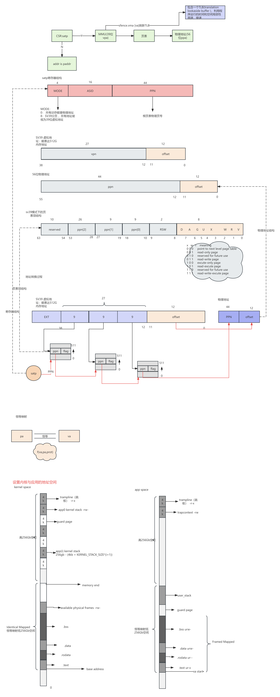
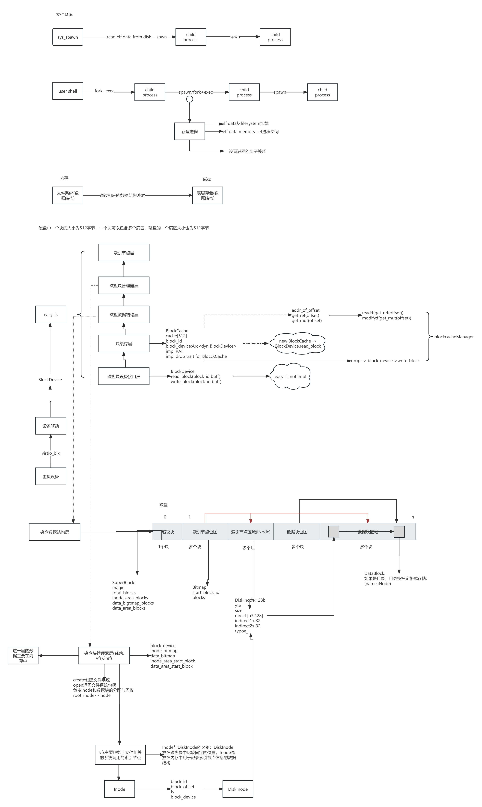
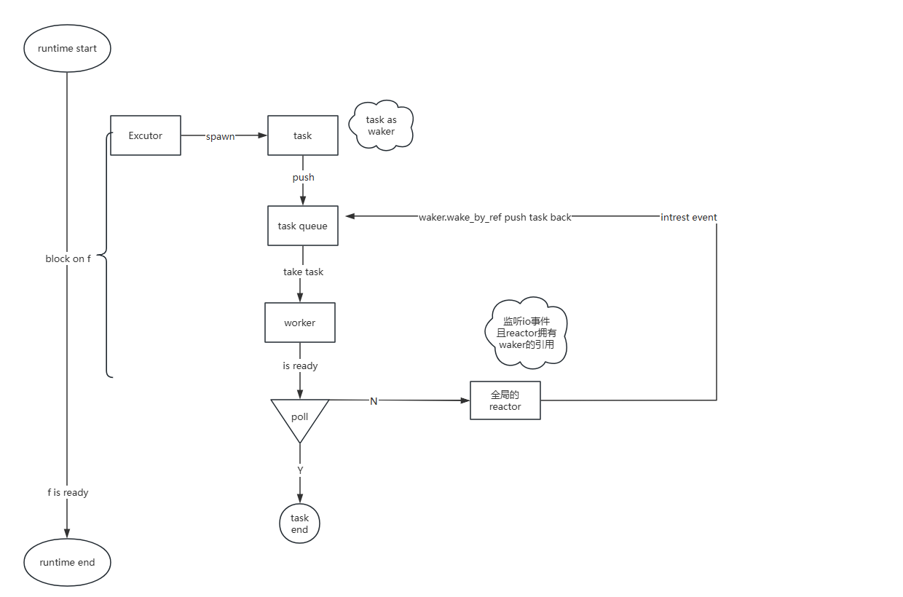
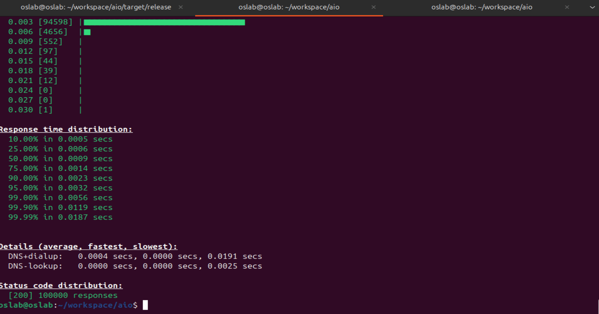
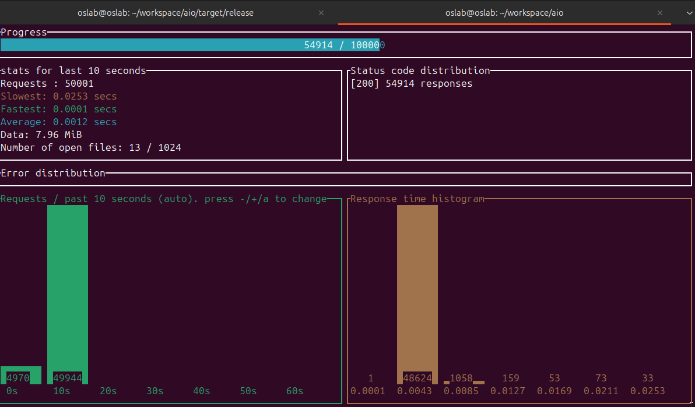
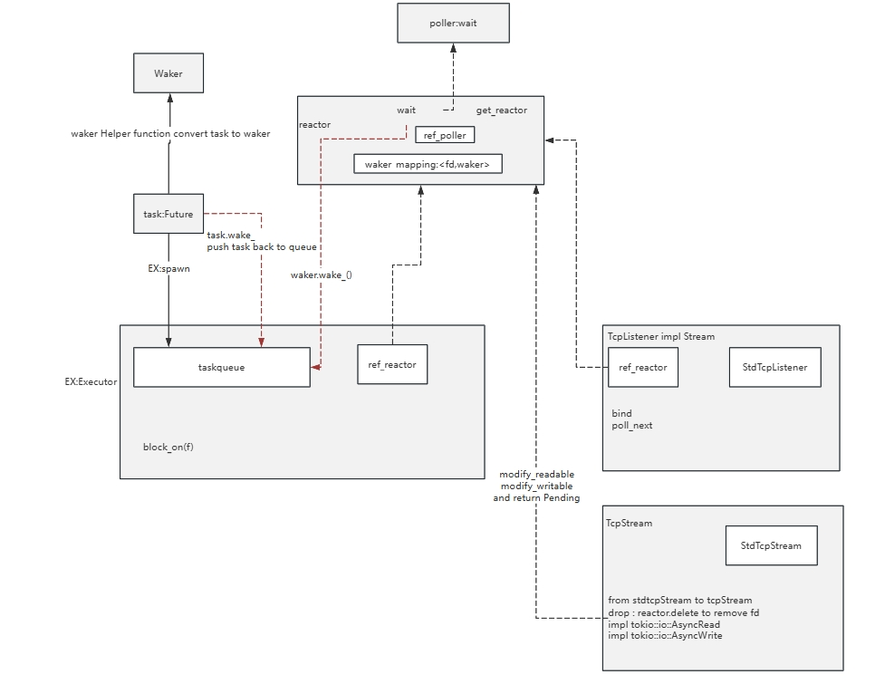
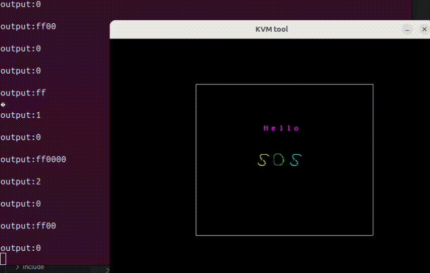

# os_blog
os学习总结


## 第一阶段总结

1年前开始学习rust，初衷是了解一门操作系统级别的开发语言(深入了解，作为工作语言那种)。并为此写了系列的微信公众号文章《拥抱未来语言Rust》并在社区取得了不错的反响，感兴趣的可以微信公众号搜索“三角兽”，欢迎关注。
rust作为一门系统级语言，拥有高性能的同时还具有高安全性，基于RAII风格自动资源管理，避免了很多内存安全问题(这也是吸引我学习的主要原因)。本次比赛是我第一次参加的系统级比赛，通过比赛，夯实了对rust语言的理解，包括：所有权，作用域，生命周期，智能指针等。非常有意义，在此感谢主办方！

## 第二阶段总结
一直以来对OS非常感兴趣，本次通过身临其境的“代码调试”，熟悉了整个项目架构，并对OS有了进一步的深刻认识。在调试过程中不仅熟悉了OS，还对Rust语言有了更深入的认识。第二阶段的操作系统实现基于RISC-V指令集，之前没有了解过RISC-V，因此看汇编语言会有些头痛，但结合RISC-V手册加上AI的辅助，理解这些汇编代码完全没有问题。
通过第二阶段的学习，破除了一直以来对操作系统底层实现机制的迷雾，那层隔阂在应用开发人员心底的对操作系统的朦胧自此打破，世界上没有彩蛋，只有认识盲区，破除这些盲区，就是扩大自己的认知，增加自己的技术自信。后面打算写系列的博客来总结、分享操作系统，影响更多的人来学习操作系统。

下面是第二阶段各个实验的总结，重要的知识点我都画成了流程图，希望帮到需要的人。

### lab1
这是第一个实验，整体难度不大，通过print打印信息调试，一天过关。


### lab2
地址空间映射这一章知识密度较高，反复看了几遍才基本弄懂，调试代码陆陆续续调试了3天。(还是太菜，菜就多练！)

简单总结下本章：在开启分页SV39分页之前，OS和都是直接访问物理地址，这给系统带来很多潜在的安全隐患，例如地址空间未隔离等。开启分页模式后，OS和用户代码中就都是虚拟地址了，需要通过页表和MMU进行转换，并且页表上的属性区分出了U和S，进行了权限和空间的隔离，分别在特权级和地址空间上保证了OS内核的安全，同时也保证了用户程序之间相互隔离，彼此空间不会重叠。(虚拟空间可以重叠，但通过页表映射后通常是隔离的，有种特殊情况是通过映射到相同的物理也实现内存共享)

另外为了OS在开启分页后能平滑的访问，对于OS采用的是恒等映射(虚拟页号=物理页帧)。而对于用户程序通常采用Framed映射，通过栈式页帧分配器分配页帧并和虚拟页号建立映射关系，动态生成页表及页表项，实现物理页帧的按需分配。

另外一个比较好的抽象是地址空间MemorySet，它作为任务的一部分，管理着页表及和逻辑区。在实现采用了RAIL机制，加上rust的所有权及drop trait自动实现页表项的释放。



### lab3
sys_spawn第一版实现测试通过，但是到实验4发现实现有问题，然后修改为exec+fork的方式完成。

### lab4
文件系统章节是我花时间最多的一个章节，时间主要花在了对文件系统的理解上，看源码也费了些时间。将细节通过在线文档整理如下图所示：


### lab5
死锁检测可以基于银行家算法实现，参考Wiki

## 第三阶段总结
第三阶段基础知识阶段，让我了解到了几个不同的方向，分别是Unikernel、MicroKernel、Hypervisor、以及Async OS。主键化开发思想非常重要，将系统无关的公共逻辑抽象出来形成crate，达到软件复用的效果。让我第一次认识到原来OS开发也可以像App开发一样，按模块自由组合，基于底层的积木搭建高楼大厦。
工作方面的原因，第三节段的作业我没有太深入的去做，所有的课程录屏及PPT都有仔细观看和阅读，后面抽时间好好做一做课后作业，相信会加深对OS的理解。
另外结合自身实际，选择项目四作为实习方向。一直对高并发，异步比较感兴趣（其实对虚拟化也挺感兴趣的，但是对陌生的指令集比较恐惧，怕花太多的时间反而没太大的结果）。
系统通过第四阶段对异步操作系统的研究及tokio源码的注释，对异步有更深入的了解，虽然我不是从事系统类软件开发，但始终相信，学习操作系统底层，对上层应用开发也大有裨益，最后感谢清华大学的操作系统课程，后面会写系列博客分享，为社区助力！


## 第四阶段总结
第四阶段为项目实战阶段，和前三阶段最大的不同是该阶段不是面向测例开发了，而是根据自己的兴趣选择一个喜欢的研究方向并进行实际成果的输出。我选择的方向是异步方向，并且根据我自身的实际情况，选择实现一个基于io_uring的用户态的异步运行时。选择这个方向有几个考量：
- 我自身从事大数据开发工作，已不再可能从事底层操作系统开发
- 学习操作系统课程，主要是打破对操作系统的迷雾，增加自己技术深度，通过前三个阶段的学习，已经扫除了我对操作系统的很多的迷雾，已达到了我学习这门课程的初衷，在此由衷的感谢。
- 平时有接触高并发的场景，并且对高并发感兴趣，选择深入研究异步运行时，高并发对我的工作有利。
第四阶段共分为三周，其中每周的工作内容如下：
### 第一周
本周工作：
1.阅读200行代码实现绿色线程代码，理解其实现原理和机制（实例代码中每个绿色线程都有一个栈，无法支撑万级别并发，无栈协程如何实现？Async/wait）
2.阅读blog-os中关于async/await部分博客，理解rust async/awarit实现机制及在os中的应用

下周安排：
1.阅读tokio源码，并形成文档。之前看tokio官网，输出了一篇博客：学习tokio官方文档，写了一篇博客：https://mp.weixin.qq.com/s/rqpFyf7-Cx6Ota7e9zbOOg
2.阅读io_uring相关文档

我的目标：
1.通过清华的课程的学习主要目的是扫清对底层操作系统的一些迷雾，能更好的赋能业务开发。
2.实现用户态的一个异步运行时
3.工作中使用过rust tokio,期望合作输出tokio源码注解文档，加深对异步的理解

### 第二周
#### 1、学习reactor模式和proactor模式
这两种模式是两种高性能的网络模式
reactor是实现同步编程的重要设计模式：reactor可以简单理解为事件来了之后，操作系统通知应用程序处理。reactor又分为以下几种模式：

- 单reactor单线程
- 单reactor多线程
- 多reactor单线程(性能不具有优势，很少使用)
- 多reactor多线程

proactor是实现异步编程的重要设计模式：proactor可以简单理解为，来了事件之后，操作系统来处理，处理完成之后再通知应用程序。

目前tokio的子项目io-uring实现了异步的网络模型。

#### 2、学习io-uring

io-uring是linux内核中的异步IO框架，提供了高性能的系统调用，减少系统调用和上下文切换来提高IO性能。

##### io-uring基本概念：
通过mmap内存映射的方式完成用户空间和内核空间对SQ和CQ的内存共享。
主要包含以下抽象：
- SQ:提交队列
- SQE：提交列表项，表示IO请求
- SQ Ring:SQ环形缓冲区，包含SQ,头部索引head,尾部索引tail，SQ队列大小
- CQ：完成队列
- CQE：完成队列项，表示IO请求的结果
- CQ Ring: CQ环形缓冲区，包含CQ，头部索引head，尾部索引tail，CQ队列大小
- SQ线程：内核辅助线程，从SQ中获取SQE，并提交给内核处理，将IO请求结果生成的CQE放置到CQ队列

##### 系统提供的系统调用
io_uring_setup:初始化io_uring环境，创建io_uring实例
io_uring_enter:提交和等待，可以指定提交的操作数量和等待时间
io_uring_register:注册fd到io_uring实例

##### io_Uring库
- liburing
- tokio io-uring


#### 3、实现一个异步运行时，初步理解运行时中的角色及协作关关系
https://github.com/reganzm/hug_rust/tree/main/%E6%89%8B%E6%92%B8%E7%B3%BB%E5%88%97/mini_async_runtime

#### 4、rust异步执行原理

异步执行参与的角色及协作关系

##### 参与角色：

executor: 执行异步任务，提供spawn方法生成task，并push到task queue

task:封装future成为一个任务

waker:用于唤醒任务，通过wake或wake_by_ref方法，将task重新发送到执行队列等待调度

reactor:基于更底层的epoll或者io_uring系统调用，监听intrest事件，并调用waker唤醒任务。
reactor以下方法用于注册fd并监听intrest事件：
- add : 添加fd到poller中，poller实现了基于epoll的事件监听机制，它通过系统调用完成
- modify_readable: fd监听可读事件
- modify_writable:fd监听可写事件
- wait：用于等待可用事件，poller中至少有一个事件发生则返回处理，由waker_mapping映射拿到waker，并调用waker.wake
- delete:删除需要监听io事件的fd文件描述符
- push_complete:reactor维护waker_mapping，建立文件描述符和waker的映射关系，当io时间发生，调用可以调用waker上的wake方法唤醒任务，使任务重新加入任务队列进行调度

##### 协作图：



##### 参考资料：

github上的一个基于reactor+epoll的代码库：mini-rust-runtime

如果要实现io_uring的异步运行时，可以基于此项目将epoll替换为io_uring。

#### 5、tokio 源码阅读及注解

##### 从example的hello_world出发

##### 运行时的初始化

通过注解#[tokio::main]初始化tokio运行时，下面方法是等价的

```rust
通过注解初始化
#[tokio::main]
async fn main(){

}
通过Runtime实例化
fn main(){
	let mut rt = tokio::runtime::Runtime::new().unwrap();
	rt.block_on(
		async{}
	)
}
```

Runtime是初始化做了哪些工作？

进入到Runtime代码中，可以看到它是基于构建者模式并按照配置进行构建。Runtime有三种类型：

- CurrentThread

- MultiThread

- MultiThreadAlt

这里查看CurrentThread的视线，初始化过程中主要完成以下事情：
- 创建scheduler调度器
- 创建阻塞线程池
- handler

最主要的逻辑在build_current_thread_runtime_components方法中。


精确的模糊，模糊的精确

阅读源码部分主要还是在IDE中，边读边注解。后续理清了模块，画一个协作框架图出来更容易自上而下进行原理的把握。


#### 下周工作计划

- 继续深入理解tokio框架和源码
- 实现一个支持io-uring的异步运行时
- 参考资料及开源库
  tokio的子项目io-uring 
  mio
  rio
  uring-positioned-io
  greeter


#### 未来工作

可以考虑基于实现的异步运行时，实现一个web框架(类似于go gin , java spring，python flask等)

支持：

- 路由、分组路由（字典树）
- 上下文管理
- 中间件
- 模板
- 错误恢复及错误处理
- ...

### 第三周
开发一个异步运行时框架，底层基于reactor+io_uring实现，基于该运行时实现了http服务，能返回html网页。并和reactor+repoll实现的异步运行时进行了性能对比。
github仓库地址：https://github.com/reganzm/aio
#### reactor+io_uring(main分支代码)
服务默认监听127.0.0.1:12345，启动端口后，在浏览器中输入http://127.0.0.1:12345，会返回相关的信息

使用oha压力测试软件进行测试如下：

压测数据如下：
```
Summary:
  Success rate:	100.00%
  Total:	20.0148 secs
  Slowest:	0.0220 secs
  Fastest:	0.0001 secs
  Average:	0.0012 secs
  Requests/sec:	4996.3035

  Total data:	15.83 MiB
  Size/request:	166 B
  Size/sec:	809.95 KiB

Response time histogram:
  0.000 [1]     |
  0.002 [89448] |■■■■■■■■■■■■■■■■■■■■■■■■■■■■■■■■
  0.004 [8290]  |■■
  0.007 [1461]  |
  0.009 [401]   |
  0.011 [181]   |
  0.013 [160]   |
  0.015 [32]    |
  0.018 [4]     |
  0.020 [12]    |
  0.022 [10]    |
```
#### reactor+epoll(reactor_epoll分支代码)
使用oha进行压测数据如下：

压测数据如下：
```
Summary:
  Success rate:	100.00%
  Total:	20.0123 secs
  Slowest:	0.0253 secs
  Fastest:	0.0001 secs
  Average:	0.0011 secs
  Requests/sec:	4996.9388

  Total data:	15.93 MiB
  Size/request:	167 B
  Size/sec:	814.93 KiB

Response time histogram:
  0.000 [1]     |
  0.003 [93233] |■■■■■■■■■■■■■■■■■■■■■■■■■■■■■■■■
  0.005 [5718]  |■
  0.008 [637]   |
  0.010 [149]   |
  0.013 [92]    |
  0.015 [39]    |
  0.018 [21]    |
  0.020 [61]    |
  0.023 [35]    |
  0.025 [14]    |
```
项目代码结构如下：


目前实现比较简单，从压测的表现可以看出io_uring性能比epoll好，io_uringresponse大部分集中在0.002，而epoll大部分集中在0.003，后面考虑丰富实现，并进行进一步的测试。


## 学期总结
三个月的学习生涯不紧不慢，转眼即逝，通过坚持学习，最终还是有所收获的，消除了很多从大学时期一直到工作中对操作系统的很多迷雾，从这一点来讲，所有的坚持和付出都值得，保持对技术的好奇心，选定方向，终身学习吧！

下面是这段时间做的一些简单的操作系统，附上链接：
### aos 一个简单的支持异步输入的os（参考自blog-os）
https://github.com/reganzm/aos


### sos 一个基于x86采用c语言实现的简易os
https://github.com/reganzm/sos/tree/tiny_os_64
